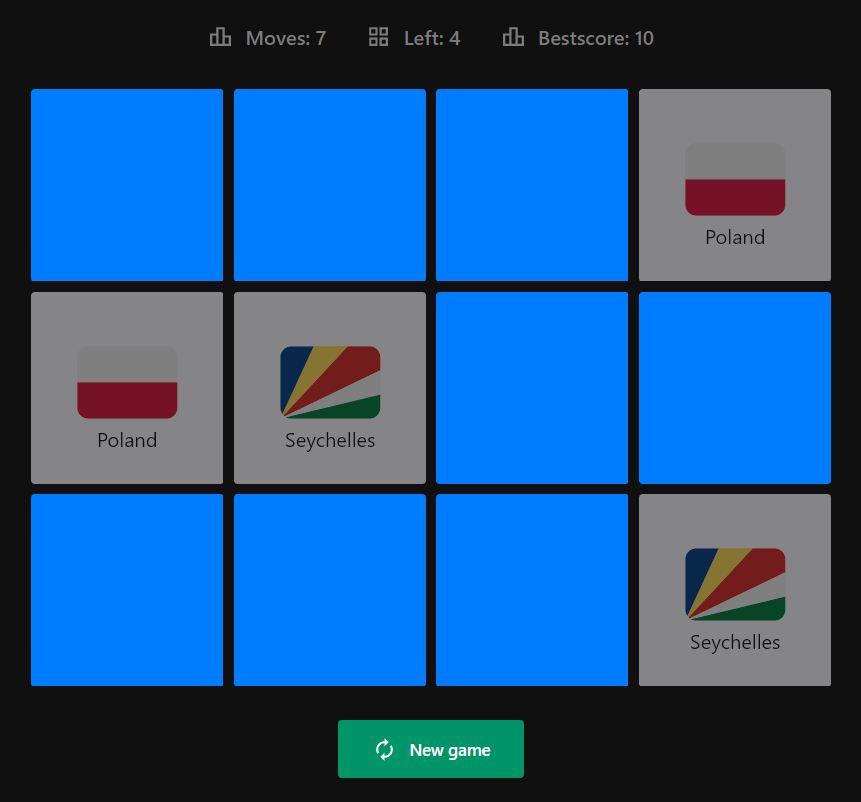

# React Memory Game

- flip cards to match flags
- live version [here](https://rplbc.github.io/react-memory-game/)

## Usage

```bash
# clone
git clone https://github.com/rplbc/react-memory-game
cd react-memory-game

# install & run
yarn && yarn start
```

## 👀


